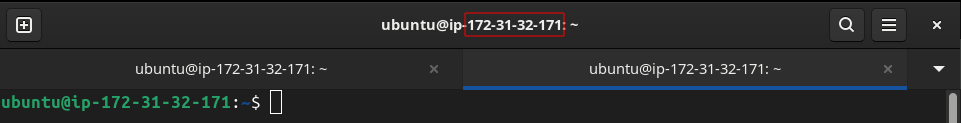
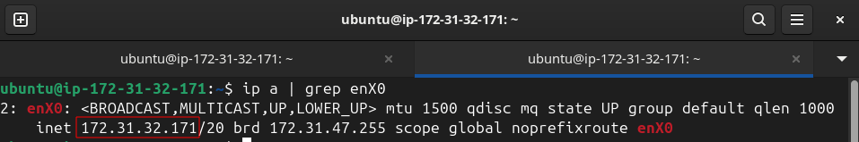

# Module 1: Setting Up the Development Environment

**Duration:** ~20 minutes

Welcome to the first module of the Milestone Runtime Platform workshop! In this module, you'll set up your development environment and verify that all components are working correctly.

## 🎯 Learning Objectives

By the end of this module, you will:
- ✅ Have successfully connected to your development environment
- ✅ Installed and configured the Runtime Platform
- ✅ Installed and verified App Center functionality
- ✅ Installed your first sample application
- ✅ Be familiar with the development tools and environment

## 📋 Prerequisites

- Remote desktop connection established (as per main README)
- Credentials sheet with XProtect server details
- Visual Studio Code open and ready

## 🚀 Step-by-Step Instructions

### Step 1: Verify Your Development Environment (5 minutes)

1. **Check Visual Studio Code:**
   - Ensure VS Code is running
   - Check terminal access (View → Terminal)

2. **Verify Network Connectivity:**
   - Open a web browser
   - Test internet connectivity
   - Ping the XProtect server (details on your credentials sheet)

### Step 2: Install Runtime Platform

1. **Start Runtime Installer:**
   The Runtime Installer is already available on the machine. To make it easier for you, an alias named `runtime-installer` including the necessary parameters to setup the development environment is available on the system.

   **Note:** 
   - `--cluster-sandbox` will set up a local sandbox repository to test your apps.
   - `--cluster-dev-mode` will set up the environment for development purposes, including the Kubernetes and Helm dashboards to ease debugging and development.
   - If you want to see the parameters used, you can check the wrapper script by running `cat ~/bin/runtime-installer` in the terminal.
   
   To set up the Runtime Platform and App Center for a development environment, run the following command in a terminal:
   ```bash
   # Open the terminal
   # Run the alias to start the Runtime Installer:
   runtime-installer
   ```

   Follow the prompts in the installer, using steps below.

2. **Select Language**
   - And press `Start`.

3. **Connect to Runtime Platform host:**
   - For the workshop this is the **same machine as you are working on**, so use the IP shown in the terminal title:
     
     
   - Or find it by invoking following command: `ip a | grep enX0`
     
     
   - **User name** is the same as you use to log into the VM (ubuntu).
   - **Password** is either the one you changed it to, or the original one if you didn't.
   - Press `Next`.

4. **Select a System/Deployment Name:**
   - No spaces, use e.g., `dev-summit-workshop`
   - Press `Next`.
   - All dependencies will be automatically installed on the host.

5. **Choose Default Storage Settings:**
   - Accept the defaults and press `Next`.
6. **Skip certificate setup:**
   - Press `Next`.
7. **Provide Connection information for XProtect:**
   - Use the details from your credentials sheet.
   - Press `Next`.
8. **Review Summary and Install:**
   - Review the summary of your selections.
   - Press `Install` to begin the installation.
9. **While waiting for installation to complete:**
   - Move on to [Module 2: Exploring App Builder & Documentation](../module-2-app-builder/README.md) to get familiar with App Builder CLI and documentation, and **come back when installation is done**.
   - If you finish Module 2 before installation is done, you can prepare for [Module 4](../module-4-sample-app/README.md), check out the sample application repository, and look through the samples while waiting.

### Step 3: Install Sample Application (2 minutes)

1. Once the Runtime Platform installation is complete, proceed to open the App Center web interface using the button in the Runtime Installer.

2. **Browse Available Applications:**
   - Open App Center interface
   - Log in using your XProtect credentials
   - Navigate to "Find new apps", filter on "Video OS" and select "Httpd Webgl".
     - Have a look at the overview and press "Install".
     - Once the installed toaster pops-up and the state is no longer "Installing", press the app in the list and look at logs and metrics to see that it is running.
     - Navigate to `http://<cluster ip>/httpd-webgl` to see the application in action.
       - Note that it might take a moment for the routing rules to be applied. If you get an RBAC error, wait a moment and refresh.
   - If you see a globe and a spinning cube, the application is running successfully!

## 🔍 Verification Checklist

Before proceeding to Module 2, ensure you have:

- [ ] Runtime Platform services running successfully
- [ ] App Center accessible via web interface
- [ ] XProtect VMS connection established
- [ ] At least one sample application installed and working
- [ ] Development tools (VS Code) functioning

## 🛠️ Troubleshooting

### Common Issues:

**Runtime Platform Installation Fails:**
- Save installation logs for review
- Consult workshop instructors

**App Center Connection Issues:**
- Verify XProtect server credentials
- Check network connectivity
- Ensure XProtect VMS is running

**Sample Application Won't Install:**
- Verify Runtime Platform is operational

## 📚 Additional Resources

- [Runtime Platform Installation Guide](https://download.milestonesys.com/app-builder/Documentation/Runtime%20Installation%20Wizard.pdf)

## ➡️ Next Steps

Once you've completed this module successfully, proceed to:
**[Module 2: Exploring App Builder & Documentation](../module-2-app-builder/README.md)**

---

**Need Help?** Ask your workshop instructor or check the troubleshooting section above.